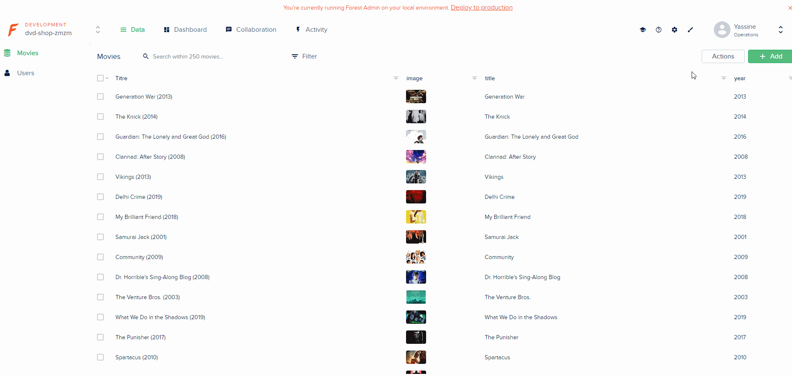

# Movie API and Admin Panel

This an API that create random user and associate them to some movie store in the API, and an admin panel using [Forest Admin](https://www.forestadmin.com/)

## Packages used

- [Faker](https://github.com/marak/Faker.js/)

- [Forest Admin](https://www.forestadmin.com/)

- [Mongoose](https://www.npmjs.com/package/mongoose)

- [Express](https://www.npmjs.com/package/express)

- [Cors](https://www.npmjs.com/package/cors)

# Install

Go to the API project `cd dvd-shop-api` and run `npm` in your console to install all dependencies and `npx nodemon` to launch.
You should have a Forest Admin account to see the admin panel.

